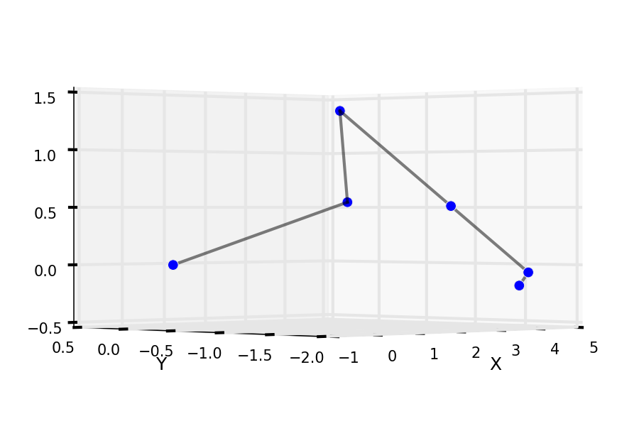

Robot-Kinematic
===============

Forward and Backward Kinematics with Denavit-Hartenberg Formalism

With the DH configuration

```python
#                                        Th,   d,    r,    al
konfiguration = OrderedDict([
                ('Fahrzeug', [0.0, 0.0, 0.0, roll]),
                ('Verschubrahmen', [0.0, verschub_Z, verschub_X, 0.0]), # Verschubrahmen von Mitte Hinterachse
                ('Verschubschlitten', [0.0, 0.0, 0.0, 90.0]),
                ('Dreharm', [90.0, -verschub_Y-0.08, dreharm_Z, 90.0]), # jetzt z nach vorn, x nach oben
                ('Hauptarm', [hauptarm_R+180.0-53.0, 0.0, hauptarm_L, 0.0]),
                ('Nebenarm', [nebenarm_R, 0.0, nebenarm_L, 0.0]),
                ('Schnellwechselsystem', [schnellwech_R, 0.0, schnellwech_L, 0.0])
                ])
```
to this


